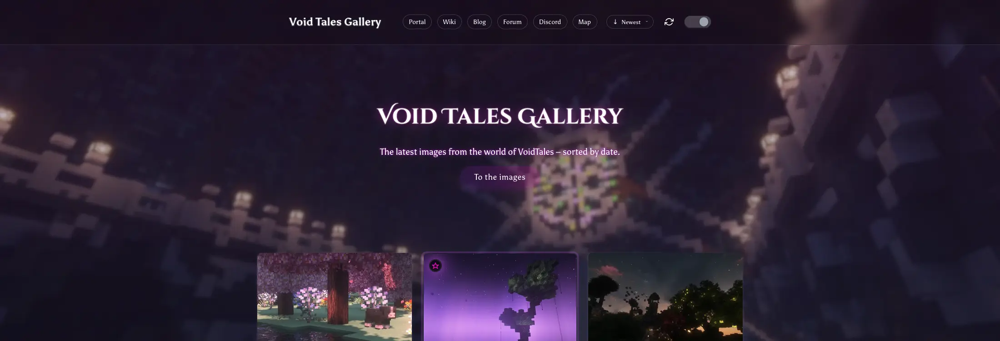

# 🎨 VoidTales Gallery



A sleek, high-performance photo gallery built with [Astro](https://astro.build/), TypeScript, and vanilla CSS/JS.  
Showcase your photos with modern design, automatic sorting, and seamless dark mode – no heavy frameworks, just pure speed.

---

## ✨ Features

- 🚀 **Blazing-fast static generation** with Astro for instant loading
- 🖼️ **Markdown-driven photo management** – Add metadata like dates for automatic sorting
- 📅 **Smart sorting** – Photos sorted by `date` (newest first, precise to the millisecond)
- 🌗 **Instant dark mode** – Flicker-free theme switching with local storage and CSS variables
- 📱 **Fully responsive** – Optimized for desktop, tablet, and mobile with CSS Grid
- ⚡ **Performance-first** – Lazy loading images, efficient CSS, and WebP thumbnails
- ♿ **Accessible lightbox** – Powered by GLightbox for smooth image viewing and screen reader support
- 🎨 **Refined UI** – Transparent sticky header with blur, centered logo, and mobile menu
- 🖼️ **Automatic thumbnail generation** – Node script using Sharp for optimized WebP images
- 🔧 **Config-driven site** – Control navigation, meta-tags, hero text, and more via `src/config/`
- 📥 **Optional external downloads** – Automatically fetch markdown files and images from internal/external URLs during build (configurable via environment variables)
- 🔄 **Refresh Button** – Instantly reloads all thumbnails and resources without cache, so you always see the latest images after updates.
- 🆔 **Unique IDs for Images** – Each image now uses a unique ID to ensure the share button works reliably in GLightbox.
- 📤 **GLightbox Share & View Original Buttons** – The lightbox now includes a share button and a "view original" button for quick access and sharing.

---

## 🚀 Getting Started

### 📦 1. Install Dependencies
```bash
pnpm install
```
Key dependencies: Astro, Preact, GLightbox (for lightbox), Sharp (for thumbnails), dotenv (for environment variables), and TypeScript.

### 🖼️ 2. Add Your Images
Place original images in:
```
public/images/original/
```
Example: `public/images/original/photo.jpg`

### 🛠️ 3. Generate Thumbnails (Recommended)
Run the script to create optimized WebP thumbnails:
```bash
pnpm run gen:thumbs
```
Thumbnails will be saved in `public/images/thumbs/` (sizes: 200px, 400px, and 800px for high-resolution).

### 🗂️ 4. Add Photo Metadata
Create Markdown files in:
```
src/content/photos/
```
Example: `src/content/photos/photo.md`

Each file needs frontmatter like this:
```markdown
---
id: "unique-image-id"           # Unique ID for the image (used for sharing and GLightbox features)
title: "My Photo"
slug: "my-photo"
date: "2023-10-01T12:34:56"     # ISO format for sorting (precise to seconds)
fullsizePath: "/images/original/photo.webp"
thumbPath: "/images/thumbs/photo-400.webp"
width: 1600
height: 900
caption: "A beautiful moment"
---
```

### 📥 5. Optional: Set Up External Downloads
If you want to automatically download markdown files and images from external sources during the build process:

- Set environment variables in your `.env` file or build environment:
  ```
  EXT_DL_URL_MARKDOWN=http://your-internal-server/markdown/
  EXT_DL_URL_ORIGINAL=http://your-internal-server/original/
  EXT_DL_URL_MARKDOWN_EXTERNAL=http://your-external-server/markdown/  # Fallback
  EXT_DL_URL_ORIGINAL_EXTERNAL=http://your-external-server/original/  # Fallback
  ```

- Configure the download behavior in `src/config/externaldownload.cjs`:
  ```javascript
  // External download configuration file: Defines settings for downloading external markdown files and images.
  // Uses environment variables for URLs and enables/disables download scripts during build.

  require('dotenv').config(); // Load environment variables from .env file as fallback option

  module.exports = {
    // Flag to enable/disable markdown file download script
    enableCopyMdFiles: true, // -> Customizable: set to true or false as needed
    
    // Flag to enable/disable original image download script
    enableCopyOriginalImages: true, // -> Customizable: set to true or false as needed
    
    // ===========================================
    // DONT TOUCH THIS BELOW //
    // ===========================================

    // Internal URL for markdown files (from environment variable)
    mdSourceUrlInternal: process.env.EXT_DL_URL_MARKDOWN,
    
    // External fallback URL for markdown files (from environment variable)
    mdSourceUrlExternal: process.env.EXT_DL_URL_MARKDOWN_EXTERNAL,
    
    // Internal URL for original images (from environment variable)
    originalSourceUrlInternal: process.env.EXT_DL_URL_ORIGINAL,
    
    // External fallback URL for original images (from environment variable)
    originalSourceUrlExternal: process.env.EXT_DL_URL_ORIGINAL_EXTERNAL,
  };
  ```

- The build scripts will attempt to download from internal URLs first, falling back to external URLs if needed. If no URLs are set, the build proceeds without downloads.

### ▶️ 6. Start Development Server
```bash
pnpm run dev
```
Open [http://localhost:4321](http://localhost:4321) to see your gallery.

---

## 📁 Project Structure

```
├── public/
│   ├── images/
│   │   ├── original/     # Your full-size images (or downloaded from external sources)
│   │   └── thumbs/       # Auto-generated WebP thumbnails (200px, 400px, 800px)
├── src/
│   ├── components/
│   │   ├── Header.astro          # Sticky header with nav, centered logo, mobile menu, theme toggle, and refresh button
│   │   ├── PhotoGrid.astro       # Server-rendered wrapper for PhotoGridClient
│   │   ├── PhotoGridClient.tsx   # Client-side grid with GLightbox lightbox
│   │   ├── ThemeToggle.jsx       # Modern theme switcher with CSS animations
│   │   └── RefreshButton.astro   # Button to reload thumbnails/resources without cache
│   ├── config/
│   │   ├── externaldownload.cjs  # Config for external downloads (enable/disable, URLs via env vars)
│   │   ├── navigation.js         # Config for nav links (Portal, Wiki, Blog, Forum, Discord, Map)
│   │   └── site.js               # Config for site metadata (name, description, URLs, hero text, etc.)
│   ├── content/
│   │   └── photos/               # Markdown files with photo metadata (date, paths, etc.) – can be downloaded externally
│   ├── pages/
│   │   └── index.astro           # Main page with hero, sorting, and gallery
│   └── styles/
│       ├── variables.css         # CSS variables and dark mode
│       ├── base.css              # Reset, typography, links
│       ├── layout.css            # Container, grid, background effects, Flexbox for footer
│       ├── components.css        # Photo, header, footer, theme toggle, header buttons, GLightbox fixes
│       ├── hero.css              # Hero section styles with min-height for Flexbox compatibility
│       ├── responsive.css        # Media queries
│       └── accessibility.css     # Focus and accessibility
├── scripts/
│   ├── copy-md-files.cjs         # Script to download markdown files from internal/external URLs
│   ├── copy-original-images.cjs  # Script to download images from internal/external URLs
│   ├── generate-thumbs.js        # Sharp-based thumbnail generator for WebP
│   ├── refresh-resources.cjs     # Script to reload thumbnails/resources without cache
├── package.json                  # Dependencies: Astro, Preact, GLightbox, Sharp, dotenv
└── README.md
```

---

## 🔧 Customize Site and Navigation

Edit the config files in `src/config/` to customize the site:

### Navigation Links
Edit `src/config/navigation.js` to add or remove nav links. Current links:

```javascript
// Navigation configuration file: Defines links for the site navigation menu.
// Used in the header or navigation component to render external links.

export const navigationLinks = [
  // Portal link: Main entry point for VoidTales services
  { label: 'Portal', href: 'https://portal.voidtales.win' },
  
  // Wiki link: Community wiki for VoidTales information
  { label: 'Wiki', href: 'https://wiki.voidtales.win' },
  
  // Blog link: Official blog for updates and news
  { label: 'Blog', href: 'https://blog.voidtales.win' },
  
  // Forum link: Community discussion forum
  { label: 'Forum', href: 'https://forum.voidtales.win' },
  
  // Discord link: Invite to the VoidTales Discord server
  { label: 'Discord', href: 'https://discord.gg/QEMQsFect6' },
  
  // Map link: Dynamic map of the VoidTales world
  { label: 'Map', href: 'https://dynmap.voidtales.win' },
];
```

### Site Metadata and Hero
Edit `src/config/site.js` for site-wide settings like meta-tags, hero text, and URLs:

```javascript
// Site configuration file: Defines global settings for the VoidTales Gallery site.
// Used across the application for metadata, SEO, and UI elements like hero and footer.

export const siteConfig = {
  // Site name: Displayed in the browser title and meta tags
  name: 'VoidTales Gallery',
  
  // Site description: Used for SEO meta description and social media previews
  description: 'A sleek, high-performance photo gallery built with Astro, TypeScript, and vanilla CSS/JS. Showcase your photos with modern design, automatic sorting, and seamless dark mode.',
  
  // Site URL: Base URL for the site, used for canonical links and sitemaps
  // This also sets the base URL for Astro and sitemap generation
  url: 'https://gallery.voidtales.win',
  
  // Fonts: Array of font URLs to be loaded for the site
  fonts: [
    'https://fonts.googleapis.com/css2?family=Macondo&family=Macondo+Swash+Caps&display=swap'
  ],

  // Font family: Main font family for the site, used via CSS variable
  fontFamily: "'Macondo', cursive",
  
  // Open Graph image: Path to image used for social media previews (place in public/images/)
  ogImage: '/images/og-image.webp',
  
  // Site author: Name of the site creator or maintainer
  author: 'inventory69',
  
  // Keywords: Array of keywords for SEO and meta tags
  keywords: ['photo gallery', 'Astro', 'VoidTales', 'images', 'modern web'],
  
  // Hero section configuration: Defines content for the main hero area on the homepage
  hero: {
    title: 'Discover the VoidTales Gallery',  // Main headline for the hero section
    subtitle: 'The latest images from the world of VoidTales – sorted by date.',  // Subtitle text
    cta: 'To the images',  // Call-to-action button text
  },
  
  // Footer configuration: Defines content for the site footer
  footer: {
    copyright: 'VoidTales',  // Copyright text displayed in the footer
  },
};
```

> **Note:**  
> - The `url` property sets both the canonical site URL and the base URL for Astro and sitemap generation.
> - You can configure the site's fonts and font family directly in `siteConfig` using the `fonts` and `fontFamily` properties.

---

## 🆕 Recent Improvements

- **Refresh Button:** Instantly reloads all thumbnails and resources without cache.
- **Unique IDs for Images:** Each image uses a unique ID for reliable sharing in GLightbox.
- **GLightbox Share & View Original Buttons:** The lightbox now includes a share button and a "view original" button.
- **Removed Fancybox:** All lightbox functionality is now handled by GLightbox.
- **Header Buttons:** Improved styling and consistency for header action buttons.

---

## 🤝 Contributing

We welcome contributions to improve VoidTales Gallery! Whether you're fixing bugs, adding features, or enhancing documentation, your help is appreciated. Here's a streamlined guide to get started:

### 🛠️ 1. Fork and Clone the Repository
- Visit [https://github.com/inventory69/voidtales-gallery](https://github.com/inventory69/voidtales-gallery) and click "Fork".
- Clone your fork locally: `git clone https://github.com/your-username/voidtales-gallery.git`.

### 🌿 2. Set Up Your Development Environment
- Install dependencies: `pnpm install`.
- Generate thumbnails if adding images: `pnpm run gen:thumbs`.
- Start the dev server: `pnpm run dev` and visit [http://localhost:4321](http://localhost:4321).

### 📝 3. Make and Test Your Changes
- Create a feature branch: `git checkout -b feature/your-feature-name`.
- Edit code, add images, or update docs.
- Test thoroughly: Ensure thumbnails are generated, run `pnpm run dev`, and check responsiveness.
- Commit changes: `git add . && git commit -m 'feat: Add your feature description'`.

### 📤 4. Submit a Pull Request (PR)
- Push your branch: `git push origin feature/your-feature-name`.
- Open a PR on GitHub with a clear title and description (e.g., "Add Discord link to navigation").
- Reference any related issues.

### 🚀 Preview and Review
- Automated preview deployments are available for PRs with collaboration rights – test your changes live via the provided link.
- Address reviewer feedback promptly to expedite merging.

### 📋 Guidelines
- Follow TypeScript and Astro best practices.
- Keep commits descriptive and atomic.
- Update README/docs for new features.
- Ensure accessibility and performance are maintained.
- No heavy frameworks; stick to vanilla CSS/JS where possible.

For questions, join our [Discord](https://discord.gg/QEMQsFect6) or open an issue. Thanks for contributing! 🚀

---

## 📝 Notes

- **Sorting**: Photos are automatically sorted by `date` (newest first, precise to milliseconds).
- **Hero Section**: Customizable intro area in `index.astro`.
- **Lightbox**: Uses GLightbox for accessibility and performance.
- **Thumbnails**: Generated via Sharp in WebP format.
- **Dark Mode**: Flicker-free, stored in localStorage, uses CSS variables.
- **Performance**: Images lazy-load; CSS is optimized.
- **Header**: Transparent, sticky, with blur and mobile menu.
- **Background Effects**: Blurred images with overlay for Light/Dark Mode to create an elegant look.
- **Minimal Frameworks**: Pure Astro + TypeScript + CSS/JS, Preact only for lightweight client interactions.
- **Build**: Includes thumbnail generation in `build` script for production.
- **External Downloads**: Optional feature for fetching content from internal/external servers. Configure via environment variables and `src/config/externaldownload.cjs`. If disabled or no URLs set, the build runs normally without downloads.

---

## 📜 License

MIT License

Copyright (c) 2025 inventory69 & Hyphonical

Permission is hereby granted, free of charge, to any person obtaining a copy of this software and associated documentation files (the "Software"), to deal in the Software without restriction, including without limitation the rights to use, copy, modify, merge, publish, distribute, sublicense, and/or sell copies of the Software, and to permit persons to whom the Software is furnished to do so, subject to the following conditions:

The above copyright notice and this permission notice shall be included in all copies or substantial portions of the Software.

THE SOFTWARE IS PROVIDED "AS IS", WITHOUT WARRANTY OF ANY KIND, EXPRESS OR IMPLIED, INCLUDING BUT NOT LIMITED TO THE WARRANTIES OF MERCHANTABILITY, FITNESS FOR A PARTICULAR PURPOSE AND NONINFRINGEMENT. IN NO EVENT SHALL THE AUTHORS OR COPYRIGHT HOLDERS BE LIABLE FOR ANY CLAIM, DAMAGES OR OTHER LIABILITY, WHETHER IN AN ACTION OF CONTRACT, TORT OR OTHERWISE, ARISING FROM, OUT OF OR IN CONNECTION WITH THE SOFTWARE OR THE USE OR OTHER DEALINGS IN THE SOFTWARE.